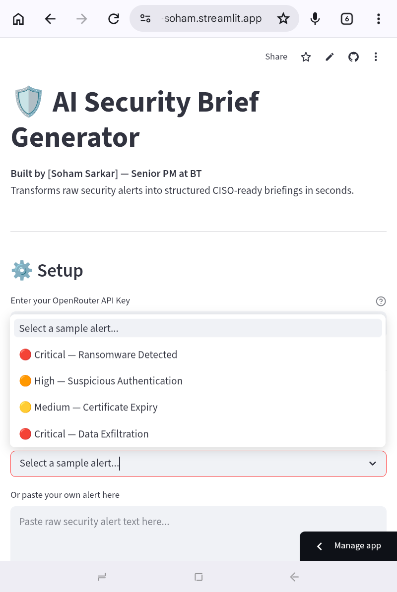

# AI Security Brief

## Problem
Security teams are overwhelmed with alerts.
Analysts spend 60% of their time reading and 
triaging — not responding. Critical threats 
get missed in the noise.

## Who It's For
Security analysts and CISOs at mid-to-large 
enterprises who use Google Security products.

## What It Does
An AI tool that:
- Ingests raw security alerts
- Summarises each one in plain English
- Classifies severity (Critical / High / Medium)
- Drafts a briefing ready to send to the CISO

## My Product Decisions
1. **Confidence score is mandatory** — analysts 
   need to know when to trust AI vs investigate manually

2. **Minimum evidence threshold** — fewer than 3 
   specific indicators forces CONFIDENCE: Low.
   Discovered via adversarial testing. Vague alerts 
   were returning Medium confidence — dangerous in 
   a security context.

3. **One recommended action only** — multiple options 
   cause analyst paralysis in high-stress situations

4. **Model agnostic architecture** — built on OpenRouter 
   so the tool works regardless of which AI provider 
   is available. Validated when Gemini's API failed 
   during build.

## Eval Criteria
Before shipping this to a real enterprise:
- 95%+ accuracy on severity classification
- 0% hallucination on company/system names
- Summary generated in under 3 seconds
- Safe fallback when confidence is low

## Success Metrics

### Layer 1 — Model Quality
- Severity classification accuracy: >95%
- Hallucination rate on proper nouns: 0%
- Confidence calibration: tracked from day 1

### Layer 2 — Product Experience
- Task completion rate: >80%
- Time to generate brief: <5 minutes
- Analyst correction rate: <20%
- Abandonment at AI step: <5%

### Layer 3 — Business Impact
- Analyst hours saved per week (baseline TBD)
- Security error rate vs pre-AI baseline
- Override rate trend: should decrease week/week

### The Metric I'm Watching Most
Override rate over time.
Decreasing = trust being earned.
Flat or increasing = model or UX problem.
Zero from day one = users not actually checking
= safety risk.

## Status
✅ Live — Deployed May 2026
🌐 Try it: https://ai-security-brief-by-soham.streamlit.app
📄 Full PRD: See PRD.md
🔨 Built in public — follow the journey on LinkedIn
